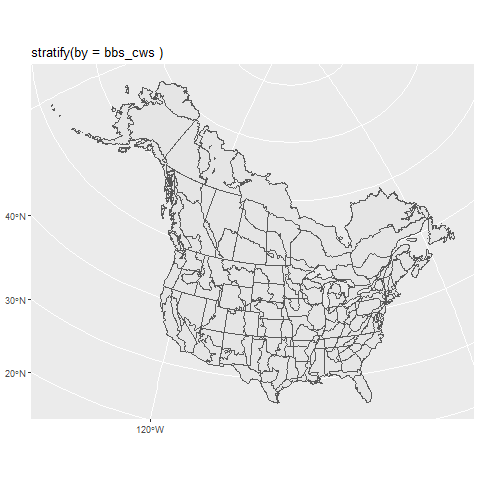
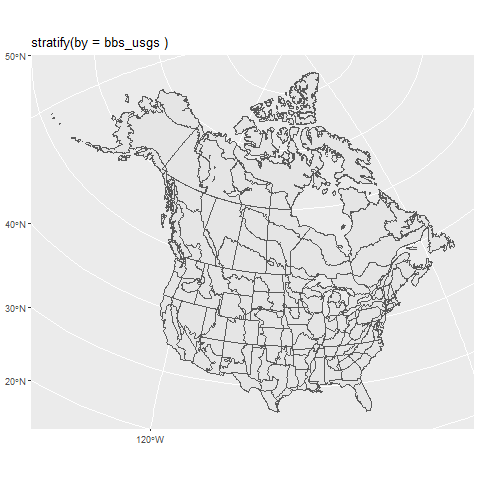
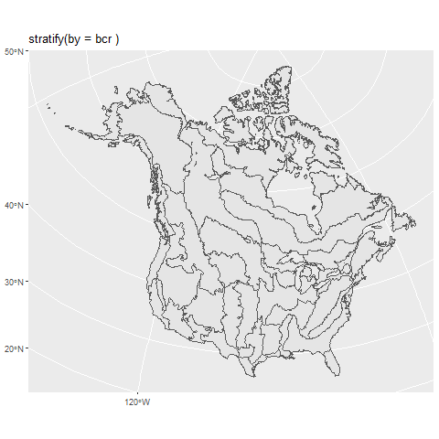
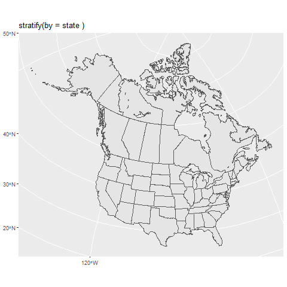
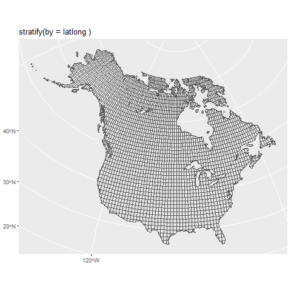

# Stratification {#Stratify}

## Strata

All of the models supported by bbsBayes expect the BBS route-level data to be grouped into geographic strata. These strata are subregions of the survey area, and allow the parameters that model abundance and trend to vary across a species' range.

Use the `stratify()` function to group the BBS data into one of the included stratifications. Select the stratification using the argument `by` to stratify by the following options:

-   bbs_cws -- `stratify(by = "bbs_cws")` Political region X Bird Conservation region intersection (Canadian Wildlife Service [CWS] method). Identical to bbs_usgs, except all routes in BCR 7 are combined into a single stratum, and all routes in PEI and Nova Scotia are combined into a single stratum.



-   bbs_usgs -- `stratify(by = "bbs_usgs")` Political region X Bird Conservation region intersection (United Status Geological Survey [USGS] method)



-   bcr -- `stratify(by = "bcr")` Bird Conservation Region only



-   state -- `stratify(by = "state")` Political Region only



-   latlong -- `stratify(by = "latlong")` Degree blocks (1 degree of latitude X 1 degree of longitude)



Now that we know the built-in stratification options, let's stratify our copy of the BBS data. Here, we will choose to stratify our data using the "bbs_cws" method:
```{r, cache=TRUE}
# set up for the annual CWS status and trend analysis
strat_data <- stratify(by = "bbs_cws")
```

```{r,echo=FALSE}
save(list = c("strat_data"),file = "Stratified_data_cws.RData")
```


The stratified_data object includes 3 dataframes.

-   `strat_data$species_strat` is a table of all species included in the dataset. It has columns for species common names in English, French, and Spanish, as well as information on the order, family, genus, species, and the numerical species indicators used in the BBS database in both character format (with leading 0s) and integer format.
```{r}
knitr::kable(head(strat_data$species_strat[,c(3,4,5,8,9,10)]))
```


-   `strat_data$bird_strat` is a very large table of each observed count for a given species X route X year combination. This is the table that includes all of the non-zero observations in the BBS database.
```{r}
knitr::kable(head(strat_data$bird_strat[,c(1,2,6,7,14,16,17)]))
```


-   `strat_data$route_strat` is a large table of each BBS survey conducted. It includes a single row for each survey-event (i.e., a route X year X observer combination). It also includes the information on the weather conditions, timing, date, etc.
```{r}
knitr::kable(head(strat_data$route_strat[,c(2,3,8,13,33:35)]))
```

### Useful code to access and print the strata maps above

The package does not include functions to directly access the strata maps (other than the `generate_map()` function, which displays a map of estimated trends). However this code below should suffice to find the map files in your local installation.

```{r maps,echo=TRUE,eval = FALSE}
library(sf)
library(sp)
library(ggplot2)
laea = st_crs("+proj=laea +lat_0=40 +lon_0=-95") # Lambert equal area coord reference system

strat_maps <- c("BBS_CWS_strata",
"BBS_USGS_strata",
"BBS_BCR_strata",
"BBS_LatLong_strata",
"BBS_ProvState_strata")

names(strat_maps) <- c("bbs_cws","bbs_usgs","bcr","latlong","state")

locat = system.file("maps",
                    package = "bbsBayes")

for(i in 1:length(strat_maps)){
  map.file = strat_maps[i]
  st_nm = names(strat_maps)[i]
strata_map = read_sf(dsn = locat,
                     layer = map.file)
strata_map = st_transform(strata_map,crs = laea)
st_gg = ggplot(data = strata_map)+
geom_sf()+
labs(title = paste("stratify(by =",st_nm,")"))


png(paste0("images/map_",st_nm,".png"))
print(st_gg)
dev.off()
}
```
