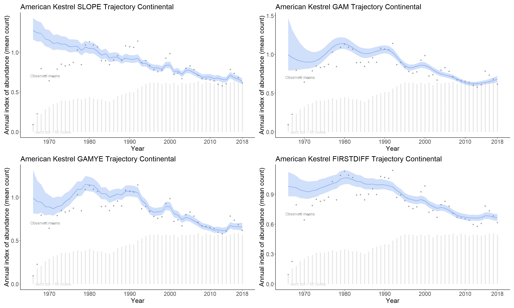

# Prepare the data for a model and species {#DataPrep}

```{r, cache=TRUE,echo=FALSE,eval = FALSE}
# set up for the annual CWS status and trend analysis
strat_data <- stratify(by = "bbs_cws")
```

```{r,echo=FALSE}
load("Stratified_data_cws.RData")
```

## Prepare data for a model and species

The `prepare_jags_data()` function is used to select a species, a model, the time-scale, etc.

The critical arguments are:

-  strat_data: the list of stratified data returned by `stratify()`
-  species_to_run: the English name for the species. this is currently case sensitive, and must exactly match one of the names in the english column of the species_strat object of strat_data i.e., `strat_data$species_strat$english`
    If you'd like to export a full list of the available species, this code will work:
```{r,eval=FALSE}
write.csv(strat_data$species_strat,"Full_BBS_speciesList.csv")
```
    Also, if you'd like to select a species using the French name, you can try this:
```{r}
espece = "Colibri à gorge rubis"
species = strat_data$species_strat$english[which(strat_data$species_strat$french == espece)]
species
```

-  model: the model to use, options are "slope", "firstdiff", "gam", or "gamye"

There are additional, optional arguments:

- heavy_tailed - Logical indicating whether the extra-Poisson error distribution should be modeled as a t-distribution, with heavier tails than the standard normal distribution. Default is currently FALSE, but recent research suggest users should strongly consider setting this to TRUE, even though it requires much longer convergence times

-  n_knots - Number of knots to be used in GAM function

-  min_year - Minimum year to keep in analysis

-  max_year - Maximum year to keep in analysis

-  min_n_routes - Minimum routes per strata where species has been observed. Defaults to 3, but consider lowering to 1 if using the "latlong" stratification

-  min_max_route_years - Minimum number of years with non-zero observations of species on at least 1 route. Defaults to 3

-  min_mean_route_years - Minimum average of years per route with the species observed. Defaults to 1.


## Models

The package has (currently) four status and trend models that differ in the way they model the time-series of observations. The four model options are slope, gam, gamye, and firstdiff. 

### slope

The slope option estimates the time series as a log-linear regression with random year-effect terms that allow the trajectory to depart from the smooth regression line. It is the model used by the USGS and CWS to estimate bbs trends between 2011 and 2018. The basic model was first described in 2002 ([@link2002]) and its application to the annual status and trend estimates is documented in [@sauer2011] and [@smith2014].


### gam

The gam option models the time series as a semiparametric smooth using a Generalized Additive Model (GAM) structure that shares information among the strata on the shape of the population trajectory. This model is described in [@smith2020a].


### gamye

The gamye option includes the semiparametric smooth used in the gam option, but also includes random year-effect terms that track annual fluctuations around the smooth, also in [@smith2020a]. This is the model that the Canadian Wildlife Service is now using for the annual status and trend estimates.


### firstdiff

The firstdiff option models the time-series as a random-walk from the first year, so that the first-differences of the sequence of year-effects are random effects with mean = 0 and an estimated variance. This model has been described in [@link]. The first difference model is unique among these four in that it does not share information across the strata on the rate of population change. The population trajectories in each stratum are estimated independently of all other strata.


## CWS analysis example

The annual CWS analysis uses the heavy-tailed version of the GAMYE model. Here's the data function call that is used in the 2019 analysis for Scarlet Tanager:
```{r prepdata, eval=FALSE}
jags_data <- prepare_jags_data(strat_data = strat_data,
                  species_to_run = "Scarlet Tanager",
                  model = "gamye",
                  min_max_route_years = 2,
                  heavy_tailed = TRUE)

```
