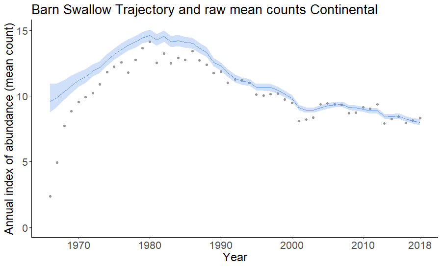
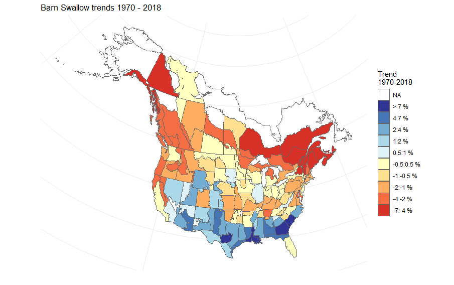

## Overview
This repository is the beginning of a bookdown project to hold workshop content on using bbsBayes. FYI, it's largely just a skeleton right now, but by mid-December should be complete.

bbsBayes is a package to perform hierarchical Bayesian analysis of North American Breeding Bird Survey (BBS) data. 'bbsBayes' will run a full model analysis for one or more species that you choose, or you can take more control and specify how the data should be stratified, prepared for JAGS, or modelled.

 

